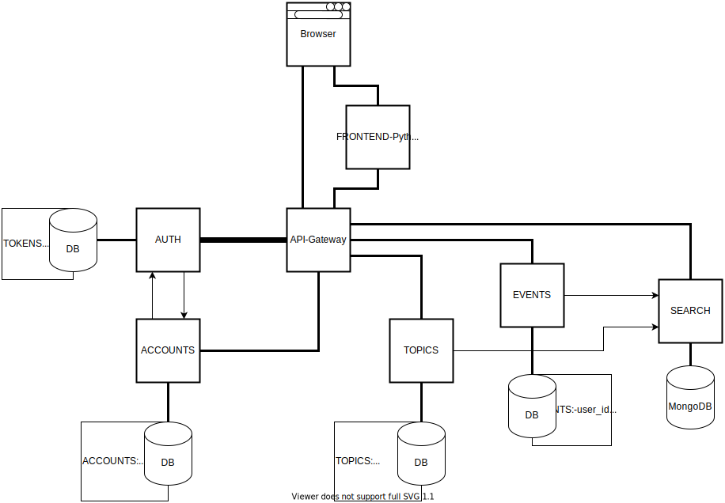

# System Manifest

Description of all micro-services

## Table of content

- [General System Info](#General-System-Info)
- [Install and Run](#[Install-and-Run)
- [Auth micro-service](#auth-micro-service)
    - [General info](#Auth-General-info)
    - [External API](#Auth-External-API)
    - [Internal API](#Auth-Internal-API)
- [Accounts micro-service](#accounts-micro-service)
    - [General info](#Accounts-General-info)
    - [External API](#Accounts-External-API)
    - [Internal API](#Accounts-Internal-API)
- [Topics micro-service](#topics-micro-service)
    - [General info](#Topics-General-info)
    - [External API](#Topics-External-API)
    - [Internal API](#Topics-Internal-API)

## General System Info

System Architecture

## Install and Run

### Installing (for m-auth, m-accounts, m-topics, m-events, m-frontend-python)

1.  First of all, install Python3 packages (Ubuntu):
        
            sudo apt install git python3 python3-pip
            pip3 install virtualenv

2.  Clone repo and setup virtual environment (bash/zsh):

            git clone git@github.com:MirDimEdu/{m-service}.git
            cd {m-service}
            python3 -m virtualenv venv
            . venv/bin/activate
    
3.  Install project dependencies:

            pip3 install -r requirements.txt

### Running (for m-auth, m-accounts, m-topics, m-events, m-frontend-python)

1.  Service takes its settings through environment variables, so rename `setup.sh.template` to `setup.sh` and fill your data

2.  Initialize environment variables through `. setup.sh` / `source setup.sh`

3.  Start with `python3 main.py` or `nohup python3 main.py > bot.log &` (if needs to start in background with logs to bot.log)

## Auth micro-service

### Auth General info

- Host (local / aws): 0.0.0.0 / 
- Post: 8001
- Domain (local / aws): localhost /
- AUTH_TOKEN_NAME: X-MIRDIMEDU-Token

### Auth External API

1.  `/is_auth` [POST]:
    -   Check auth
    -   IN:
        -   `name` - token name in cookies
        -   `data` - token data
    -   OUT:
        -   `200 OK`
        -   `401 Unauthorized` with description

2.  `/login` [POST]:
    -   Login user
    -   IN:
        -   `login`
        -   `password`
    -   OUT:
        -   `200 OK` with `set-cookie`
        -   `404 User not found`
        -   `422 Incorrect password`

3.  `/logout` [GET]:
    -   Logout user
    -   OUT:
        -   `200 OK` with `delete-cookie`
        -   `401 Unauthorized`

4.  `/close_other_sessions` [POST]:
    -   Close other session
    -   IN:
        -   `password`
    -   OUT:
        -   `200 OK`
        -   `401 Unauthorized`
        -   `422 Incorrect password`

### Auth Internal API

1.  `/delete_other_sessions` [POST]:
    -   Close other sessions
    -   IN:
        -   `session_id`
        -   `account_id`
    -   OUT:
        -   `200 OK`

2.  `/delete_all_sessions` [POST]:
    -   Close all sessions
    -   IN:
        -   `session_id`
        -   `account_id`
    -   OUT:
        -   `200 OK`

## Accounts micro-service

### Accounts General info

- Host (local / aws): 0.0.0.0 / 
- Post: 8002

### Accounts External API

1.  `/register` [POST]:
    -   Register account
    -   IN:
        -   `login`
        -   `password`
    -   OUT:
        -   `201 OK`
        -   `409 User with this login already exists`

2.  `/me` [GET] - LOGIN REQUIRED:
    -   Get account info
    -   OUT:
        -   `200 OK` with account info (login, role, client, session_issued...)

3.  `/{login}` [GET]:
    -   Get account info by it's `login`
    -   OUT:
        -   `200 OK` with account info (login, role...)

4.  `/many` [POST]:
    -   Get many accounts info
    -   IN:
        -   `List`:
            -   `account_id`
    -   OUT:
        -   `200 OK` with account info (login, role...)

5.  `/change_password` [POST] - LOGIN REQUIRED:
    -   Change password and close other sessions
    -   IN:
        -   `old_password`
        -   `new_password`
    -   OUT:
        -   `200 OK`
        -   `401 Unauthorized`
        -   `422 Old and new passwords are equal`
        -   `422 Incorrect password`

### Accounts Internal API

1.  `/verify_account` [POST]:
    -   Verify account via login + password / account_id + password
    -   IN:
        -   `login` [OPTIONAL]
        -   `account_id` [OPTIONAL]
        -   `password`
    -   OUT:
        -   `200 OK` with `account_id` and `role`
        -   `404 User not found`
        -   `422 Incorrect password`

## Topics micro-service

### Topics General info

- Host (local / aws): 0.0.0.0 / 
- Post: 8003

### Topics External API

1.  `/post/create` [POST] - LOGIN REQUIRED:
    -   Create post of topic
    -   IN:
        -   `title`
        -   `text`
    -   OUT:
        -   `201 OK`

2.  `/posts/all` [GET]:
    -   Get all posts
    -   IN:
        -   `offset` [OPTIONAL QUERRY STRING]
        -   `limit` [OPTIONAL QUERRY STRING]
    -   OUT:
        -   `200 OK` with posts list
        -   `422 Offset or limit has wrong values`

3.  `/post/{post_id}` [GET]:
    -   Get post info by it's `post_id`
    -   OUT:
        -   `200 OK` with post info

4.  `/post/{post_id}/delete` [DELETE] - LOGIN REQUIRED:
    -   Delete post by it's `post_id`
    -   OUT:
        -   `200 OK`
        -   `403 Permission denied`

5.  `/post/{post_id}/comment/add` [POST] - LOGIN REQUIRED:
    -   Add comment to post by `post_id`
    -   IN:
        -   `text`
    -   OUT:
        -   `201 OK`

6.  `/post/{post_id}/comments/all` [GET]:
    -   Get all post comments by `post_id`
    -   IN:
        -   `offset` [OPTIONAL QUERRY STRING]
        -   `limit` [OPTIONAL QUERRY STRING]
    -   OUT:
        -   `200 OK` with comments list
        -   `422 Offset or limit has wrong values`

7.  `/comment/{comment_id}/delete` [DELETE] - LOGIN REQUIRED:
    -   Delete comment by it's `comment_id`
    -   OUT:
        -   `200 OK`
        -   `403 Permission denied`

### Topics Internal API

None)
